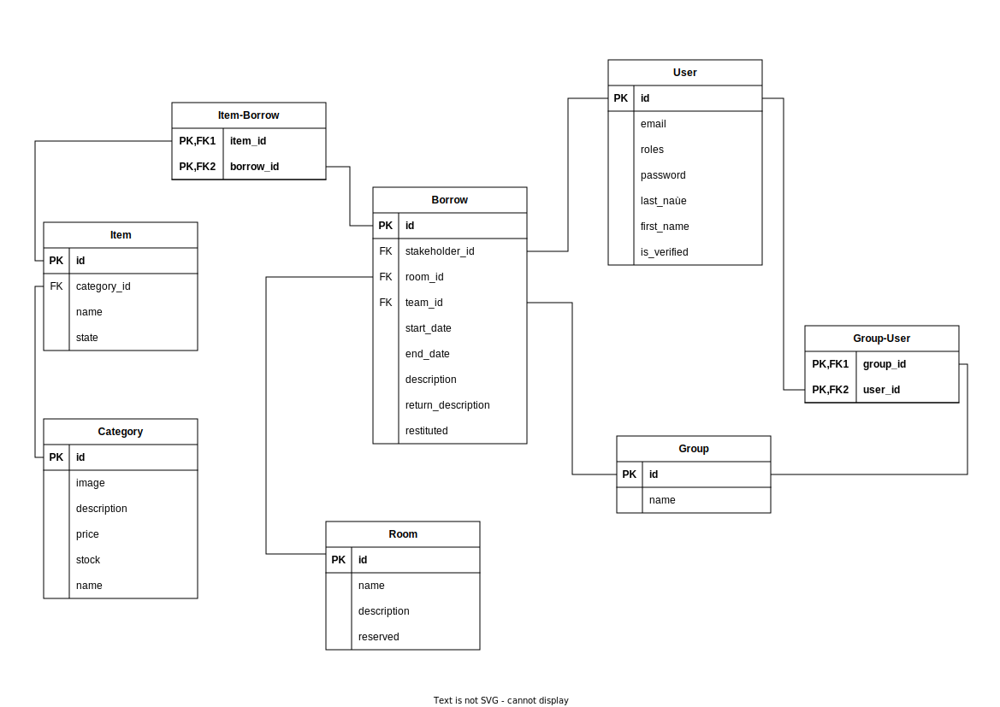

La base de données
==================

Nous avons choisi d'utiliser la base de connée MySQL, car c'est une base de données que nous avions déjà utilisé lors de notre formation.

L'architecture qui nous avons choisie pour la base de données est la suivante :

